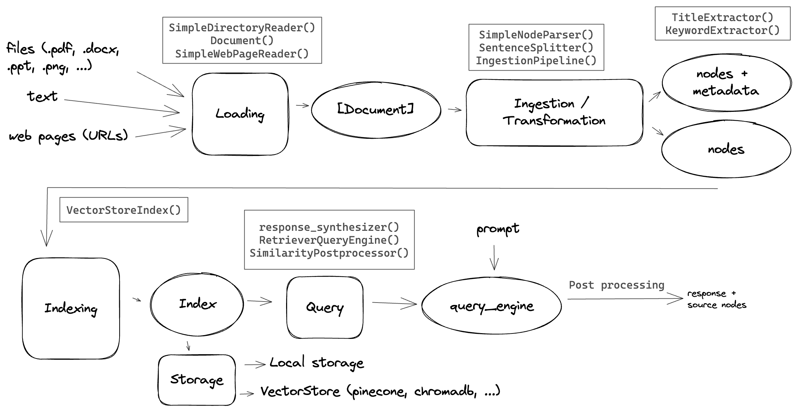

# LlamaIndex RAG Implementation Learning Notes

## 1. LlamaIndex Overview

LlamaIndex is a data framework specifically built for LLM applications, designed to connect private data with large language models. It's currently the most suitable framework for RAG implementations.

### Core Value
- Solves the problem of LLMs not being able to directly access private data
- Unifies data scattered across different applications and data stores
- Provides LLMs with natural language-based data interaction interfaces


*How LlamaIndex works (Source: Medium)*


*RAG Workflow (Source: [Building a simple hybrid RAG application with llama-index](https://moabdelhady.com/posts/building-simple-rag))*

## 2. Architecture Components

### Five Core Modules


1. **Data Connectors**
   - Extract and load data from various data sources
   - Supports databases, APIs, file systems, etc.

2. **Data Indexes**
   - Document chunking and vectorization
   - Extract metadata (keywords)
   - Build efficient retrieval indexes

3. **Query Engines**
   - Execute query processing and semantic search
   - Implement RAG (Retrieval-Augmented Generation)
   - Ensure efficient data utilization

4. **Data Agents**
   - Intelligent data processing components
   - Automatically perform data transformation, merging, enhancement
   - Context-based reasoning

5. **Application Integrations**
   - Seamless interaction with external applications
   - Supports LLMs, BI tools, SaaS platforms, etc.

## 3. Environment Setup

```bash
# Core components
pip install llama-index-core llama-index-llms-openai llama-index-readers-file llama-index-readers-web

# Document processing
pip install unstructured[pdf,docx,pptx] paddleocr pillow

# Web and text processing
pip install trafilatura cohere pypdf python-pptx

# Vector and retrieval
pip install sentence-transformers rank_bm25 llama-index-embeddings-openai

# Vector database
pip install llama-index-vector-stores-faiss faiss-cpu

# Complete framework
pip install llama-index
```

## 4. Quick Start

### Basic RAG Implementation

```python
import os
os.environ['OPENAI_API_KEY'] = 'your-api-key'

from llama_index.core import VectorStoreIndex, SimpleDirectoryReader

# Document parsing
documents = SimpleDirectoryReader('data').load_data()

# Build index
index = VectorStoreIndex.from_documents(documents)

# Build query engine
query_engine = index.as_query_engine()

# Execute query
response = query_engine.query("your question")
```

## 5. Data Connectors Deep Dive

### Local File Loader

```python
from llama_index.core import SimpleDirectoryReader
from llama_index.readers.file import PyMuPDFReader

local_loader = SimpleDirectoryReader(
    input_dir="./data",
    required_exts=[".pdf", ".docx", ".pptx", ".epub", ".md"],
    file_extractor={
        ".pdf": PyMuPDFReader(),  # With text coordinate information
    }
)
```

### Web Loader

```python
from llama_index.readers.web import BeautifulSoupWebReader

web_loader = BeautifulSoupWebReader()
web_docs = web_loader.load_data(urls=["https://example.com"])
```

### LlamaCloud Parsing (High-quality PDF parsing)

```python
from llama_cloud_services import LlamaParse

parser = LlamaParse(
    api_key="your_LLAMA_CLOUD_API_KEY",
    result_type="markdown",
    num_workers=3,
    verbose=True,
    language="ch_sim",
)

file_extractor = {".pdf": parser}
documents = SimpleDirectoryReader(
    "./data", 
    file_extractor=file_extractor
).load_data()
```

## 6. Data Indexes Deep Dive

### Chunking

```python
from llama_index.core.node_parser import SentenceSplitter

splitter = SentenceSplitter(
    chunk_size=256,
    chunk_overlap=50,
    paragraph_separator="\n\n",
    secondary_chunking_regex="<table>(.+?)</table>",  # Identify tables
    tokenizer=None
)

nodes = splitter.get_nodes_from_documents(documents)
```

### Using FAISS Vector Database

```python
from llama_index.core import Settings
from llama_index.llms.openai import OpenAI
from llama_index.embeddings.openai import OpenAIEmbedding
import faiss
from llama_index.vector_stores.faiss import FaissVectorStore

# Set up models
Settings.llm = OpenAI(model="gpt-4o")
Settings.embed_model = OpenAIEmbedding(model="text-embedding-3-small")

# Create FAISS index
d = 1536  # text-embedding-3-small dimensions
faiss_index = faiss.IndexFlatL2(d)
vector_store = FaissVectorStore(faiss_index=faiss_index)

# Create vector index
storage_context = StorageContext.from_defaults(vector_store=vector_store)
vector_index = VectorStoreIndex(nodes, storage_context=storage_context)

# Create retriever and query engine
vector_retriever = VectorIndexRetriever(
    index=vector_index,
    similarity_top_k=5
)
query_engine = RetrieverQueryEngine.from_args(retriever=vector_retriever)
```

### Retrieval Debugging

```python
# View retrieval results
retrieved_nodes = vector_retriever.retrieve("your query")
print(f"Retrieved {len(retrieved_nodes)} nodes")

for i, node in enumerate(retrieved_nodes):
    print(f"Node {i+1}:")
    print(f"Similarity score: {node.score}")
    print(f"Content: {node.node.text}")
    print("-" * 50)
```

## 7. Query Engines Advanced Features

### Chat Engine with Memory

```python
from llama_index.core.memory import ChatMemoryBuffer

memory = ChatMemoryBuffer.from_defaults(token_limit=5000)

chat_engine = index.as_chat_engine(
    chat_mode="context",
    memory=memory,
    system_prompt=(
        "You are a chatbot that answers questions based on retrieved information. "
        "If no information is retrieved, answer based on your own capabilities."
    ),
)

response = chat_engine.chat("your question")
```

### Query Engine Core Technologies

- **Query Routing**: Direct queries to the most relevant knowledge base
- **Query Rewriting**: Multi-angle query rewriting, removing inappropriate content
- **Query Planning**: Break down complex problems and plan solutions

## 8. Data Agents Intelligent Agents

### Tool Function Definition

```python
from llama_index.core.tools import FunctionTool
from typing import List

def vector_query(query: str, page_numbers: List[str]) -> str:
    """Execute vector search"""
    query_engine = vector_index.as_query_engine(similarity_top_k=5)
    response = query_engine.query(query)
    return response

# Create tool
vector_query_tool = FunctionTool.from_defaults(
    name="vector_tool",
    fn=vector_query
)
```

### Summary Tool

```python
from llama_index.core import SummaryIndex
from llama_index.core.tools import QueryEngineTool

summary_index = SummaryIndex(nodes)
summary_query_engine = summary_index.as_query_engine(
    response_mode="tree_summarize",
    use_async=True,
)

summary_tool = QueryEngineTool.from_defaults(
    name="summary_tool",
    query_engine=summary_query_engine,
    description="Use when getting article summaries",
)
```

### Intelligent Tool Calling

```python
llm = Settings.llm
response = llm.predict_and_call(
    [vector_query_tool, summary_tool],
    "your complex query",
    verbose=True
)
```

## 9. Best Practices

### Data Processing Recommendations
- Use LlamaCloud for complex PDF files
- Reasonably set chunk_size and chunk_overlap
- Choose appropriate embedding models

### Retrieval Optimization
- Use professional vector databases like FAISS
- Adjust similarity_top_k parameters
- Implement retrieval result debugging and analysis

### Production Environment Considerations
- Configure appropriate token_limit
- Use asynchronous processing to improve performance
- Implement error handling and logging

## 10. Technical Architecture Design Q&A

### Q1: Why choose FAISS over other vector databases (like Pinecone, Weaviate)? In what scenarios does FAISS perform better?

**Short Answer**: FAISS is suitable for local deployment, small-to-medium scale datasets, and cost-sensitive scenarios, with no network dependency and excellent performance. Pinecone is suitable for large-scale production environments, Weaviate for multimodal and hybrid cloud deployments. The choice mainly depends on data scale, deployment environment, and cost budget.

### Vector Database Selection Details

**FAISS vs Other Vector Database Considerations:**

- **FAISS Advantage Scenarios**:
  - Local deployment, no network dependency
  - High-performance CPU/GPU acceleration
  - Suitable for small-to-medium scale datasets (< 10M vectors)
  - Low cost, no API call fees

- **Other Options**:
  ```python
  # Pinecone - Cloud-hosted, suitable for large-scale production
  from llama_index.vector_stores.pinecone import PineconeVectorStore
  
  # Weaviate - Open source, supports multimodal
  from llama_index.vector_stores.weaviate import WeaviateVectorStore
  
  # Chroma - Lightweight, suitable for prototyping
  from llama_index.vector_stores.chroma import ChromaVectorStore
  ```

**Selection Recommendations**:
- Prototype/Small scale: FAISS or Chroma
- Large-scale production: Pinecone or Weaviate
- Hybrid cloud deployment: Weaviate
- Cost-sensitive: FAISS + Redis cache

### Q2: Currently using SentenceSplitter with chunk_size=1024, chunk_overlap=100. How were these parameters determined? Do different document types require different chunking strategies?

**Short Answer**: Parameter settings need to balance semantic completeness and retrieval accuracy. 1024 characters are suitable for most text, 100 character overlap ensures continuity. Different document types indeed require differentiated strategies: code documents use 512 characters to maintain logical integrity, academic papers use 1024-2048 characters to maintain conceptual continuity, table documents need larger chunks to avoid splitting.

### Document Chunking Strategy Optimization Details

**Parameter Setting Principles**:

```python
# Chunking strategies for different document types
def get_splitter_by_doc_type(doc_type):
    if doc_type == "code":
        return SentenceSplitter(
            chunk_size=512,      # Code logical integrity
            chunk_overlap=50,
            paragraph_separator="\n\n"
        )
    elif doc_type == "academic":
        return SentenceSplitter(
            chunk_size=1024,     # Academic content needs more context
            chunk_overlap=200,   # Larger overlap maintains conceptual continuity
            paragraph_separator="\n\n"
        )
    elif doc_type == "table_heavy":
        return SentenceSplitter(
            chunk_size=2048,     # Table data needs complete preservation
            chunk_overlap=100,
            secondary_chunking_regex="<table>(.+?)</table>"
        )
    else:
        return SentenceSplitter(
            chunk_size=1024,
            chunk_overlap=100
        )
```

**Best Practices**:
- Technical documents: 512-1024 characters
- Legal compliance: 1024-2048 characters (maintain integrity)
- Conversational data: 256-512 characters
- Academic papers: 1024-1536 characters

### Q3: Currently using similarity_top_k=5, how to determine the optimal k value? Have you considered hybrid retrieval (like BM25 + vector retrieval)?

**Short Answer**: k value needs to be dynamically adjusted based on query complexity, simple queries k=3, complex queries k=7. Hybrid retrieval can significantly improve results, vector retrieval captures semantic similarity, BM25 captures keyword matching, combining both can cover more relevant documents. Recommend using hybrid retrieval in production environments.

### Retrieval Strategy Optimization Details

**k Value Selection and Hybrid Retrieval**:

```python
from llama_index.retrievers.bm25 import BM25Retriever
from llama_index.core.retrievers import QueryFusionRetriever

# Hybrid retrieval implementation
def create_hybrid_retriever(vector_index, nodes):
    # Vector retriever
    vector_retriever = VectorIndexRetriever(
        index=vector_index,
        similarity_top_k=3  # Vector retrieval takes fewer
    )
    
    # BM25 retriever
    bm25_retriever = BM25Retriever.from_defaults(
        nodes=nodes,
        similarity_top_k=3
    )
    
    # Fusion retriever
    fusion_retriever = QueryFusionRetriever(
        retrievers=[vector_retriever, bm25_retriever],
        similarity_top_k=5,  # Final return 5 results
        num_queries=2,       # Query expansion count
    )
    
    return fusion_retriever

# Dynamic k value adjustment
def adaptive_k_selection(query_complexity):
    if "simple" in query_complexity:
        return 3
    elif "complex" in query_complexity:
        return 7
    else:
        return 5
```

### Q4: Using text-embedding-3-small, what advantages does it have over other embedding models? How to evaluate embedding quality?

**Short Answer**: text-embedding-3-small balances cost and effectiveness, fast speed, good Chinese-English performance, suitable for most application scenarios. Embedding quality can be evaluated through cosine similarity between queries and relevant documents, MRR, NDCG and other metrics. For specific domains, consider fine-tuning with sentence-transformers.

### Embedding Model Selection and Evaluation Details

**Model Comparison**:

```python
# Characteristics of different embedding models
embedding_models = {
    "text-embedding-3-small": {
        "dimensions": 1536,
        "advantages": "Low cost, fast speed, good Chinese-English performance",
        "applications": "General scenarios, cost-sensitive"
    },
    "text-embedding-3-large": {
        "dimensions": 3072,
        "advantages": "Highest accuracy, good multilingual support",
        "applications": "High accuracy requirements, multilingual scenarios"
    },
    "sentence-transformers": {
        "dimensions": "Variable",
        "advantages": "Open source, local deployment, fine-tunable",
        "applications": "Private deployment, domain-specific fine-tuning"
    }
}

# Embedding quality evaluation
def evaluate_embedding_quality(embedding_model, test_queries):
    from sklearn.metrics.pairwise import cosine_similarity
    
    results = []
    for query in test_queries:
        # Calculate similarity between query and relevant documents
        query_emb = embedding_model.get_query_embedding(query["question"])
        doc_embs = [embedding_model.get_text_embedding(doc) for doc in query["docs"]]
        
        similarities = cosine_similarity([query_emb], doc_embs)[0]
        # Calculate MRR, NDCG and other metrics
        results.append(calculate_metrics(similarities, query["relevance_labels"]))
    
    return results
```

## 11. System Design and Optimization Q&A

### Q5: Is the exception handling in the current code robust enough? How to handle API rate limiting, network timeouts and other issues?

**Short Answer**: Need to implement exponential backoff retry mechanism, circuit breaker pattern and fallback strategies. Use tenacity library for retry handling, set reasonable timeout times, automatically switch to backup solutions or local models when API rate limited. Key is to have complete error classification and corresponding handling strategies.

### Error Handling Mechanism Details

```python
import time
import logging
from tenacity import retry, stop_after_attempt, wait_exponential

class RobustRAGSystem:
    def __init__(self):
        self.logger = logging.getLogger(__name__)
        
    @retry(
        stop=stop_after_attempt(3),
        wait=wait_exponential(multiplier=1, min=4, max=10)
    )
    def query_with_retry(self, query_engine, query):
        try:
            return query_engine.query(query)
        except Exception as e:
            self.logger.error(f"Query failed: {e}")
            raise
    
    def safe_query(self, query_engine, query, fallback_response="Sorry, unable to process your request at the moment"):
        try:
            return self.query_with_retry(query_engine, query)
        except Exception as e:
            self.logger.error(f"All retries failed: {e}")
            return fallback_response
```

### Q6: For large document collections, how to optimize memory usage and query speed? Have you considered caching mechanisms?

**Short Answer**: Optimize performance through multi-level caching: memory cache for embedding results (LRU Cache), Redis cache for query results, database cache for indexes. Large document collections need batch processing, lazy loading and index sharding. Recommend using asynchronous processing and connection pools to improve concurrency.

### Performance Optimization and Caching Details

```python
import redis
import pickle
from functools import lru_cache

class CachedRAGSystem:
    def __init__(self):
        self.redis_client = redis.Redis(host='localhost', port=6379, db=0)
        
    @lru_cache(maxsize=1000)
    def cached_embedding(self, text):
        """Memory cache for embedding results"""
        return self.embedding_model.get_text_embedding(text)
    
    def cached_query(self, query):
        """Redis cache for query results"""
        cache_key = f"rag_query:{hash(query)}"
        cached_result = self.redis_client.get(cache_key)
        
        if cached_result:
            return pickle.loads(cached_result)
        
        result = self.query_engine.query(query)
        self.redis_client.setex(
            cache_key, 
            3600,  # 1 hour expiration
            pickle.dumps(result)
        )
        return result
```

### Q7: How to design architecture supporting multi-user, multi-document collections? How to implement incremental document updates?

**Short Answer**: Adopt multi-tenant architecture, each tenant maintains independent indexes and permissions. Use document version management and incremental indexing technology, new documents directly insert into existing indexes, modified documents delete then insert. Design document change queues, asynchronous processing of index updates to avoid affecting query performance.

### Scalability Architecture Details

```python
# Multi-tenant architecture design
class MultiTenantRAGSystem:
    def __init__(self):
        self.tenant_indexes = {}
        self.user_permissions = {}
    
    def get_user_index(self, user_id, tenant_id):
        """Get user-specific index"""
        index_key = f"{tenant_id}_{user_id}"
        if index_key not in self.tenant_indexes:
            self.tenant_indexes[index_key] = self.create_user_index(user_id, tenant_id)
        return self.tenant_indexes[index_key]
    
    def incremental_update(self, tenant_id, new_documents):
        """Incremental document update"""
        index = self.tenant_indexes.get(tenant_id)
        if index:
            # Add new documents to existing index
            new_nodes = self.process_documents(new_documents)
            index.insert_nodes(new_nodes)
```

### Q8: How to handle sensitive documents? Do we need to add access control and data encryption?

**Short Answer**: Sensitive documents need end-to-end encryption, encrypt document content before embedding, use encrypted embeddings during indexing. Implement Role-Based Access Control (RBAC), filter documents users don't have access to during retrieval. Consider using homomorphic encryption or differential privacy techniques to protect data security.

### Security Considerations

```python
import hashlib
from cryptography.fernet import Fernet

class SecureRAGSystem:
    def __init__(self):
        self.encryption_key = Fernet.generate_key()
        self.cipher = Fernet(self.encryption_key)
        self.user_permissions = {}
    
    def encrypt_document(self, document_text):
        """Encrypt document content"""
        return self.cipher.encrypt(document_text.encode())
    
    def filter_by_permissions(self, user_id, retrieved_docs):
        """Filter retrieval results based on user permissions"""
        user_roles = self.user_permissions.get(user_id, [])
        filtered_docs = []
        
        for doc in retrieved_docs:
            doc_security_level = doc.metadata.get("security_level", "public")
            if self.has_access(user_roles, doc_security_level):
                filtered_docs.append(doc)
        
        return filtered_docs
    
    def has_access(self, user_roles, security_level):
        """Check access permissions"""
        access_matrix = {
            "public": ["user", "admin", "manager"],
            "internal": ["admin", "manager"],
            "confidential": ["admin"]
        }
        return any(role in access_matrix.get(security_level, []) for role in user_roles)
```

## 12. Feature Extension and Evaluation Q&A

### Q9: How to extend support for images, audio and other non-text content?

**Short Answer**: Use multimodal models (like GPT-4 Vision) to extract image descriptions, process audio after converting to text. Build multimodal indexes, index image descriptions and audio transcriptions together with original documents. Design unified multimodal retrieval interface, users can query various content types with text.

### Multimodal Support Details

```python
from llama_index.multi_modal_llms.openai import OpenAIMultiModal
from llama_index.core import SimpleDirectoryReader

# Multimodal document processing
def process_multimodal_documents(directory):
    # Support mixed image and text processing
    image_documents = SimpleDirectoryReader(
        input_dir=directory,
        required_exts=[".jpg", ".png", ".pdf"]
    ).load_data()
    
    multimodal_llm = OpenAIMultiModal(model="gpt-4-vision-preview")
    
    # Image content extraction
    for doc in image_documents:
        if doc.metadata.get("file_type") in ["jpg", "png"]:
            description = multimodal_llm.complete(
                "Please describe the content of this image",
                image_documents=[doc]
            )
            doc.text = description.text
    
    return image_documents
```

### Q10: How to implement more complex conversation context management? How to handle information decay in long-term conversations?

**Short Answer**: Implement hierarchical memory management: short-term memory saves recent conversation rounds, long-term memory preserves important information through summarization. Determine retention duration based on message importance scores, regularly summarize old conversation content. Use sliding windows and importance decay algorithms to ensure memory doesn't overload while not losing critical information.

### Conversation Memory Management Details

```python
from llama_index.core.memory import ChatMemoryBuffer

class AdvancedChatMemory:
    def __init__(self, max_tokens=4000):
        self.memory = ChatMemoryBuffer.from_defaults(token_limit=max_tokens)
        self.conversation_summary = ""
        
    def add_with_decay(self, message, importance_score=1.0):
        """Memory addition with importance decay"""
        # Determine retention duration based on importance score
        if importance_score > 0.8:
            # High importance messages, extend retention time
            self.memory.put(message)
        elif importance_score > 0.5:
            # Medium importance, normal processing
            self.memory.put(message)
        else:
            # Low importance, may not retain
            pass
    
    def summarize_old_conversations(self):
        """Summarize old conversation content"""
        if len(self.memory.chat_history) > 10:
            old_messages = self.memory.chat_history[:-5]
            summary = self.llm.complete(
                f"Please summarize the key information from the following conversation: {old_messages}"
            )
            self.conversation_summary = summary.text
            # Clean old messages, keep summary
            self.memory.chat_history = self.memory.chat_history[-5:]
```

### Q11: How to adjust retrieval and generation strategies based on user preferences?

**Short Answer**: Build user profiles, record query history, click behavior and feedback information. Dynamically adjust retrieval parameters (like k value, similarity threshold) and generation style based on user preferences. Use reinforcement learning to optimize personalized strategies, let the system continuously learn user preferences and improve response quality.

### Personalized Customization Implementation

```python
class PersonalizedRAG:
    def __init__(self):
        self.user_profiles = {}
        
    def update_user_profile(self, user_id, query, feedback_score):
        """Update personal preferences based on user feedback"""
        if user_id not in self.user_profiles:
            self.user_profiles[user_id] = {
                "preferred_detail_level": "medium",
                "topic_interests": {},
                "response_style": "neutral"
            }
        
        profile = self.user_profiles[user_id]
        
        # Adjust preferences based on feedback
        if feedback_score > 0.8:
            profile["topic_interests"][self.extract_topic(query)] = \
                profile["topic_interests"].get(self.extract_topic(query), 0) + 1
    
    def personalized_query(self, user_id, query):
        """Personalized query processing"""
        profile = self.user_profiles.get(user_id, {})
        
        # Adjust retrieval parameters based on user preferences
        detail_level = profile.get("preferred_detail_level", "medium")
        k_value = {"low": 3, "medium": 5, "high": 8}.get(detail_level, 5)
        
        # Personalized retrieval
        retriever = self.get_personalized_retriever(user_id, k_value)
        results = retriever.retrieve(query)
        
        # Personalized generation
        response_style = profile.get("response_style", "neutral")
        system_prompt = self.get_style_prompt(response_style)
        
        return self.generate_response(results, query, system_prompt)
```

### Q12: How to quantify RAG system performance? What metrics should be used to evaluate retrieval quality and generation quality?

**Short Answer**: Use precision, recall, NDCG, MRR to evaluate retrieval quality; use ROUGE, BERT Score, factual accuracy to evaluate generation quality. Establish automated evaluation processes including manually annotated test sets, online A/B testing and user satisfaction surveys. Key is to build multi-dimensional, quantifiable evaluation systems.

### Evaluation Metrics System Details

```python
class RAGEvaluator:
    def __init__(self):
        self.metrics = {}
    
    def evaluate_retrieval(self, queries, ground_truth):
        """Retrieval quality evaluation"""
        from sklearn.metrics import ndcg_score
        
        precision_scores = []
        recall_scores = []
        ndcg_scores = []
        
        for query, truth in zip(queries, ground_truth):
            retrieved_docs = self.retrieve(query)
            
            # Calculate precision and recall
            relevant_retrieved = set(retrieved_docs) & set(truth["relevant_docs"])
            precision = len(relevant_retrieved) / len(retrieved_docs)
            recall = len(relevant_retrieved) / len(truth["relevant_docs"])
            
            # Calculate NDCG
            relevance_scores = [1 if doc in truth["relevant_docs"] else 0 
                              for doc in retrieved_docs]
            ndcg = ndcg_score([truth["relevance_labels"]], [relevance_scores])
            
            precision_scores.append(precision)
            recall_scores.append(recall)
            ndcg_scores.append(ndcg)
        
        return {
            "precision": np.mean(precision_scores),
            "recall": np.mean(recall_scores),
            "ndcg": np.mean(ndcg_scores)
        }
    
    def evaluate_generation(self, generated_answers, reference_answers):
        """Generation quality evaluation"""
        from rouge import Rouge
        from bert_score import score
        
        rouge = Rouge()
        rouge_scores = rouge.get_scores(generated_answers, reference_answers, avg=True)
        
        # BERT Score evaluates semantic similarity
        P, R, F1 = score(generated_answers, reference_answers, lang="zh")
        
        return {
            "rouge_l": rouge_scores["rouge-l"]["f"],
            "bert_score_f1": F1.mean().item(),
            "factual_accuracy": self.check_factual_accuracy(generated_answers, reference_answers)
        }
```

## 13. Practical Application Q&A

### Q13: For different document formats (PDF, DOCX, etc.), do we need special preprocessing steps?

**Short Answer**: Different formats need specialized preprocessors. PDF needs to handle images, tables and complex layouts, recommend using LlamaParse or PyMuPDF; DOCX needs to preserve format information; table data needs structured processing. Key is choosing appropriate parsers and preserving important structured information.

### Document Preprocessing Strategy

```python
class DocumentPreprocessor:
    def __init__(self):
        self.processors = {
            ".pdf": self.process_pdf,
            ".docx": self.process_docx,
            ".xlsx": self.process_excel,
            ".html": self.process_html
        }
    
    def process_pdf(self, file_path):
        """PDF specialized processing, preserve table and image information"""
        from llama_index.readers.file import PyMuPDFReader
        
        reader = PyMuPDFReader()
        documents = reader.load_data(file_path)
        
        # Separate table processing
        for doc in documents:
            if self.contains_table(doc.text):
                doc.metadata["has_table"] = True
                doc.text = self.format_table_text(doc.text)
        
        return documents
    
    def process_docx(self, file_path):
        """DOCX processing, preserve styles and structure"""
        import docx
        
        doc = docx.Document(file_path)
        formatted_text = ""
        
        for paragraph in doc.paragraphs:
            if paragraph.style.name.startswith('Heading'):
                formatted_text += f"\n## {paragraph.text}\n"
            else:
                formatted_text += paragraph.text + "\n"
        
        return [Document(text=formatted_text)]
```

### Q14: How to improve query understanding capabilities? Do we need to add query rewriting or query expansion features?

**Short Answer**: Query understanding needs multi-level optimization: synonym expansion, intent recognition, query rewriting and multi-angle query generation. Can use large models to automatically generate related queries, or learn query patterns based on historical query logs. Recommend implementing query preprocessing pipeline including error correction, expansion and rewriting.

### Query Understanding Optimization

```python
class QueryUnderstanding:
    def __init__(self):
        self.synonym_dict = self.build_synonym_dict()
        self.query_history = []
    
    def expand_query(self, original_query):
        """Query expansion"""
        # Synonym expansion
        expanded_terms = []
        for term in original_query.split():
            synonyms = self.synonym_dict.get(term, [term])
            expanded_terms.extend(synonyms)
        
        # Use LLM to generate related queries
        related_queries = self.llm.complete(
            f"Generate 3 query questions related to '{original_query}':"
        ).text.split('\n')
        
        return {
            "original": original_query,
            "expanded": " ".join(expanded_terms),
            "related": related_queries
        }
    
    def rewrite_query(self, query):
        """Query rewriting, handle ambiguous or incorrect queries"""
        # Spell check
        corrected_query = self.spell_check(query)
        
        # Intent recognition and rewriting
        rewritten = self.llm.complete(
            f"Rewrite the following query as a clearer search question: {corrected_query}"
        ).text
        
        return rewritten
```

### Q15: How to help users understand the source of retrieval results? How to provide better explainability?

**Short Answer**: Include source document information, relevance scores and key matching snippets when returning results. Visualize the retrieval process, show why these documents were selected. Provide "citation mode", annotate the source of each fact in the answer. Key is to let users verify and trace information sources.

### Result Explainability Enhancement

```python
class ExplainableRAG:
    def __init__(self):
        self.citation_enabled = True
        
    def query_with_explanation(self, query):
        """Query with explanation"""
        # Retrieve documents
        retrieved_docs = self.retriever.retrieve(query)
        
        # Preserve citation information when generating answers
        cited_response = self.generate_with_citations(query, retrieved_docs)
        
        # Build explanation information
        explanation = {
            "answer": cited_response.text,
            "sources": self.format_sources(retrieved_docs),
            "reasoning": self.explain_retrieval_logic(query, retrieved_docs),
            "confidence": self.calculate_confidence(retrieved_docs)
        }
        
        return explanation
    
    def format_sources(self, retrieved_docs):
        """Format source document information"""
        sources = []
        for i, doc in enumerate(retrieved_docs):
            sources.append({
                "id": i + 1,
                "title": doc.metadata.get("title", "Unknown document"),
                "snippet": doc.text[:200] + "...",
                "relevance_score": round(doc.score, 3),
                "file_path": doc.metadata.get("file_path", "")
            })
        return sources
```

### Q16: How to implement real-time document updates and index rebuilding?

**Short Answer**: Implement document change monitoring mechanism, use document version numbers and hash values to detect changes. Design incremental index update strategy: new documents directly insert, modified documents delete old version then insert new version. Use message queues for asynchronous index update processing to avoid blocking query services.

### Real-time Update Mechanism

```python
import hashlib
from watchdog.observers import Observer
from watchdog.events import FileSystemEventHandler

class DocumentWatcher(FileSystemEventHandler):
    def __init__(self, rag_system):
        self.rag_system = rag_system
        self.file_hashes = {}
    
    def on_modified(self, event):
        if not event.is_directory:
            file_path = event.src_path
            current_hash = self.calculate_file_hash(file_path)
            
            if self.file_hashes.get(file_path) != current_hash:
                # File content changed, trigger update
                self.rag_system.update_document(file_path)
                self.file_hashes[file_path] = current_hash
    
    def calculate_file_hash(self, file_path):
        """Calculate file hash value"""
        with open(file_path, 'rb') as f:
            return hashlib.md5(f.read()).hexdigest()

class RealTimeRAG:
    def __init__(self):
        self.document_versions = {}
        self.update_queue = []
    
    def update_document(self, file_path):
        """Incremental document update"""
        # Delete old version
        old_doc_id = self.document_versions.get(file_path)
        if old_doc_id:
            self.index.delete_document(old_doc_id)
        
        # Add new version
        new_doc = self.process_document(file_path)
        doc_id = self.index.insert_document(new_doc)
        self.document_versions[file_path] = doc_id
```

## 14. Deployment and Operations Q&A

### Q17: How to containerize the system for easy deployment and scaling?

**Short Answer**: Use Docker multi-stage builds to optimize image size, docker-compose to orchestrate multiple services. Design microservice architecture, separate vector database, cache, and application services. Use Kubernetes for auto-scaling and fault recovery, manage deployment configurations through Helm.

### Containerization Deployment Details

```dockerfile
# Dockerfile
FROM python:3.9-slim

WORKDIR /app

COPY requirements.txt .
RUN pip install -r requirements.txt

COPY . .

EXPOSE 8000

CMD ["uvicorn", "main:app", "--host", "0.0.0.0", "--port", "8000"]
```

```yaml
# docker-compose.yml
version: '3.8'
services:
  rag-app:
    build: .
    ports:
      - "8000:8000"
    environment:
      - OPENAI_API_KEY=${OPENAI_API_KEY}
      - REDIS_URL=redis://redis:6379
    depends_on:
      - redis
      
  redis:
    image: redis:alpine
    ports:
      - "6379:6379"
      
  vector-db:
    image: weaviate/weaviate:latest
    ports:
      - "8080:8080"
    environment:
      QUERY_DEFAULTS_LIMIT: 25
      AUTHENTICATION_ANONYMOUS_ACCESS_ENABLED: 'true'
      PERSISTENCE_DATA_PATH: '/var/lib/weaviate'
```

### Q18: How to monitor system performance and usage? What key metrics need to be recorded?

**Short Answer**: Monitor key metrics including: query response time, success rate, concurrent users, API call count and cost. Use Prometheus+Grafana for technical metrics monitoring, ELK Stack for log analysis. Record user behavior data, error logs and performance bottlenecks, establish alert mechanisms.

### Monitoring and Logging Details

```python
import prometheus_client
from prometheus_client import Counter, Histogram, Gauge

# Monitoring metrics
query_counter = Counter('rag_queries_total', 'Total number of queries')
response_time = Histogram('rag_response_time_seconds', 'Response time')
active_users = Gauge('rag_active_users', 'Number of active users')

class MonitoredRAGSystem:
    def __init__(self):
        self.logger = logging.getLogger(__name__)
        
    @response_time.time()
    def query(self, user_query):
        query_counter.inc()
        
        try:
            result = self.query_engine.query(user_query)
            self.logger.info(f"Query successful: {user_query[:50]}...")
            return result
        except Exception as e:
            self.logger.error(f"Query failed: {e}", extra={
                "query": user_query,
                "error_type": type(e).__name__
            })
            raise
```

### Q19: How to optimize API call costs? Have you considered using local models?

**Short Answer**: Control costs through intelligent caching, batch processing and model degradation strategies. Use cheaper models for simple queries, high-performance models for complex queries. Local models can serve as backup options, automatically switch when API rate limited or cost exceeded. Recommend using hybrid strategies to balance cost and effectiveness.

### Cost Control Strategy Details

```python
class CostOptimizedRAG:
    def __init__(self):
        self.daily_api_calls = 0
        self.cost_limit = 100  # USD
        
    def smart_model_selection(self, query_complexity):
        """Select model based on query complexity"""
        if self.daily_api_calls > 1000:
            # Use cheaper models during high usage
            return "gpt-3.5-turbo"
        elif query_complexity == "simple":
            return "gpt-3.5-turbo"
        else:
            return "gpt-4"
    
    def local_fallback(self, query):
        """Local model backup solution"""
        try:
            # Prioritize API
            return self.api_query(query)
        except Exception:
            # Use local model when API fails
            return self.local_model_query(query)
```

### Q20: How to design data backup and recovery strategies?

**Short Answer**: Implement 3-2-1 backup strategy: keep 3 data copies, use 2 different storage media, 1 off-site backup. Regularly backup index files, document data and configuration information. Design automated backup processes and fast recovery mechanisms, regularly test backup integrity and recoverability.

### Data Backup and Recovery

```python
import schedule
import time
import shutil
from datetime import datetime

class BackupSystem:
    def __init__(self, rag_system):
        self.rag_system = rag_system
        self.backup_paths = {
            "daily": "/backups/daily/",
            "weekly": "/backups/weekly/",
            "monthly": "/backups/monthly/"
        }
    
    def backup_index(self, backup_type="daily"):
        """Backup index data"""
        timestamp = datetime.now().strftime("%Y%m%d_%H%M%S")
        backup_path = f"{self.backup_paths[backup_type]}{timestamp}/"
        
        # Backup vector index
        self.rag_system.index.save_to_disk(f"{backup_path}/vector_index/")
        
        # Backup document data
        shutil.copytree("/data/documents/", f"{backup_path}/documents/")
        
        # Backup configuration file
        shutil.copy("/config/rag_config.yaml", f"{backup_path}/config.yaml")
        
        print(f"Backup completed: {backup_path}")
        return backup_path
    
    def schedule_backups(self):
        """Scheduled backup tasks"""
        schedule.every().day.at("02:00").do(self.backup_index, "daily")
        schedule.every().sunday.at("03:00").do(self.backup_index, "weekly")
        schedule.every().month.do(self.backup_index, "monthly")
        
        while True:
            schedule.run_pending()
            time.sleep(3600)  # Check every hour
    
    def restore_from_backup(self, backup_path):
        """Restore from backup"""
        try:
            # Restore vector index
            self.rag_system.index.load_from_disk(f"{backup_path}/vector_index/")
            
            # Restore document data
            shutil.rmtree("/data/documents/")
            shutil.copytree(f"{backup_path}/documents/", "/data/documents/")
            
            print(f"Successfully restored from {backup_path}")
            return True
        except Exception as e:
            print(f"Restore failed: {e}")
            return False
```

## 15. Advanced Optimization Strategies

### Q21: How to implement A/B testing and continuous optimization for RAG systems?

**Short Answer**: Design experimental framework, compare effects of different retrieval strategies and generation parameters. Use user feedback and business metrics to evaluate experimental results. Implement progressive rollout, test new features with small user groups first. Establish feedback loops, continuously optimize system based on data-driven insights.

### A/B Testing Framework

```python
class ABTestFramework:
    def __init__(self):
        self.experiments = {}
        self.user_assignments = {}
        
    def create_experiment(self, exp_name, variants, traffic_split):
        """Create A/B testing experiment"""
        self.experiments[exp_name] = {
            "variants": variants,
            "traffic_split": traffic_split,
            "metrics": {"conversion": [], "satisfaction": []}
        }
    
    def assign_user_variant(self, user_id, exp_name):
        """Assign experiment variant to user"""
        if user_id not in self.user_assignments:
            self.user_assignments[user_id] = {}
            
        if exp_name not in self.user_assignments[user_id]:
            # Assign variant based on user ID hash
            import hashlib
            hash_val = int(hashlib.md5(f"{user_id}_{exp_name}".encode()).hexdigest(), 16)
            traffic_split = self.experiments[exp_name]["traffic_split"]
            
            cumulative = 0
            for variant, percentage in traffic_split.items():
                cumulative += percentage
                if (hash_val % 100) < cumulative:
                    self.user_assignments[user_id][exp_name] = variant
                    break
        
        return self.user_assignments[user_id][exp_name]
    
    def log_metric(self, user_id, exp_name, metric_name, value):
        """Log experiment metrics"""
        variant = self.user_assignments.get(user_id, {}).get(exp_name)
        if variant:
            self.experiments[exp_name]["metrics"][metric_name].append({
                "variant": variant,
                "value": value,
                "user_id": user_id,
                "timestamp": datetime.now()
            })
```

### Q22: How to handle multilingual documents and queries?

**Short Answer**: Use multilingual embedding models (like multilingual-e5), support cross-language retrieval. Build separate indexes for different language documents or use unified multilingual indexes. Implement query language detection and automatic translation, ensure users can query all documents in any language.

### Multilingual Support

```python
from langdetect import detect
from googletrans import Translator

class MultilingualRAG:
    def __init__(self):
        self.translator = Translator()
        self.supported_languages = ['en', 'zh', 'ja', 'ko', 'fr', 'de']
        
    def detect_language(self, text):
        """Detect text language"""
        try:
            return detect(text)
        except:
            return 'en'  # Default English
    
    def multilingual_query(self, query):
        """Multilingual query processing"""
        query_lang = self.detect_language(query)
        
        # If not English, translate to English for retrieval first
        if query_lang != 'en':
            english_query = self.translator.translate(query, dest='en').text
            results = self.search(english_query)
        else:
            results = self.search(query)
        
        # Translate results based on user language
        if query_lang != 'en':
            translated_results = []
            for result in results:
                translated_text = self.translator.translate(
                    result.text, dest=query_lang
                ).text
                result.text = translated_text
                translated_results.append(result)
            results = translated_results
        
        return results
```
